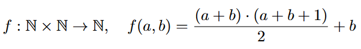

# Feature reduction using the Cantor Pairing function. Applications in Image Resizing and Image Classification Tasks

The Cantor Pairing function is a bijective transformation that maps two integer values into. Being a bijective function it provides a lossless and reversable transformation.

