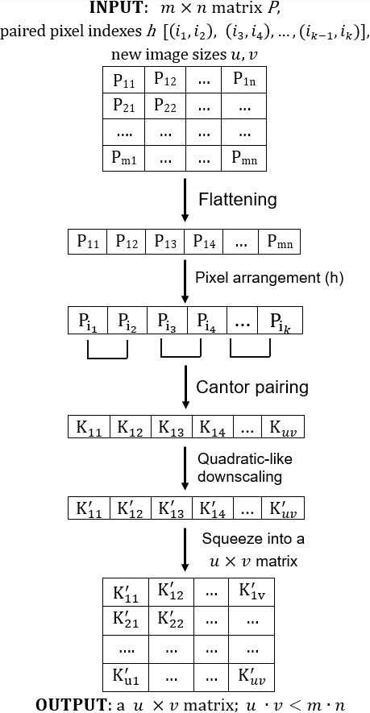
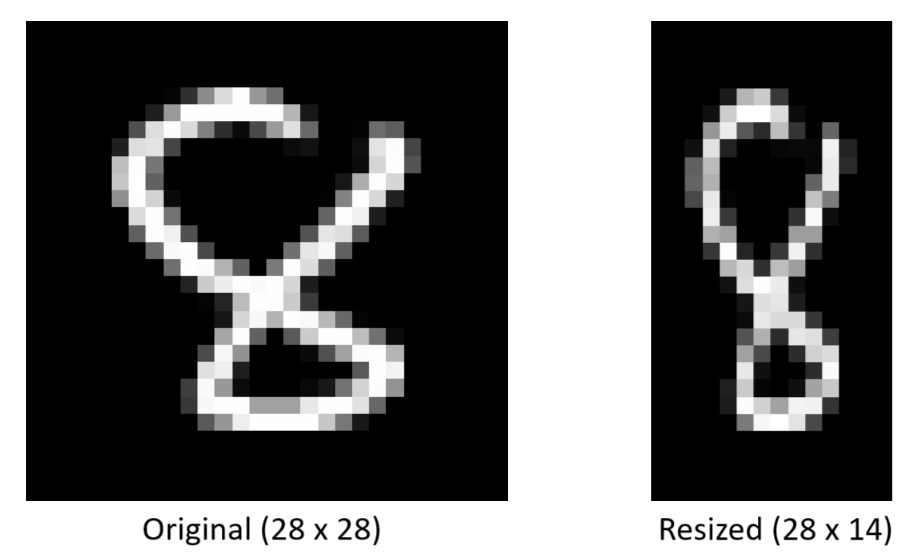
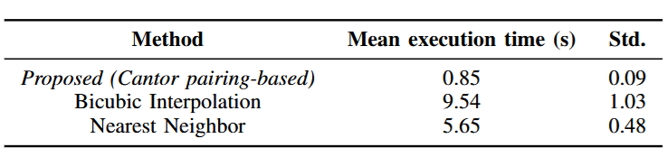

# Feature reduction using the Cantor Pairing function. Applications in Image Resizing and Image Classification Tasks

## The Cantor Pairing function

The **Cantor Pairing function** (Fig. 1) is a bijective transformation that maps two integer values into one. Being a bijective function it provides a lossless and reversable transformation.

 

**Fig. 1: Cantor Pairing function**

## Applications in Image Resizing and Image Classification Tasks

To reduce the image size using the Cantor pairing function, the key idea refers to combining two pixels (2 features) into one using the pairing function. Fig. 2 shows the image transformation schema; the parameters:
1. **a m x n (m times n) matrix P** : it represents a grayscale image
2. **paired features indexes [(i1, i2), (i3, i4), ..., (ik-1, ik)]** : the index of features used in the pairing (combination); all features can be paired (two by two) or just few of them (and the unpaired features remain with the values from the original image)
3. **new image dimension u, v** : these values are correlated to the number of features used in the pairing (linked to **k** value); the number of features used for the pairing must be selected such that in the obtained image, the number of pixels (features) to be a value that can written as a product of two integer values (i.e., u and v, which are used for width and height of the new image)
	- the most simple use case is to combine all the features (pixels) to halve the image size
	
 

**Fig. 2: Data transformation schema**

## Example of usage and execution time comparison

### Transformation example
Fig. 3 shows the transformation result after applying the proposed image resizing method on a image (digit sample) from MNIST Digits dataset. 
 

**Fig. 3: Proposed method - transformation result**

### Execution times comparison
Fig. 4 shows a comparison between the execution times of the proposed method and Bicubic Interpolation, respectively Nearest Neighbor method. The values were obtained **resizing all 70,000 images of size 28 x 28 from MNIST Digits dataset to size 28 x 14.**** The experiment was executed **10 times and the presented results are the averaged obtained values in seconds.** 
 

**Fig. 4: Mean / std. execution time of methods over 10 runs**
